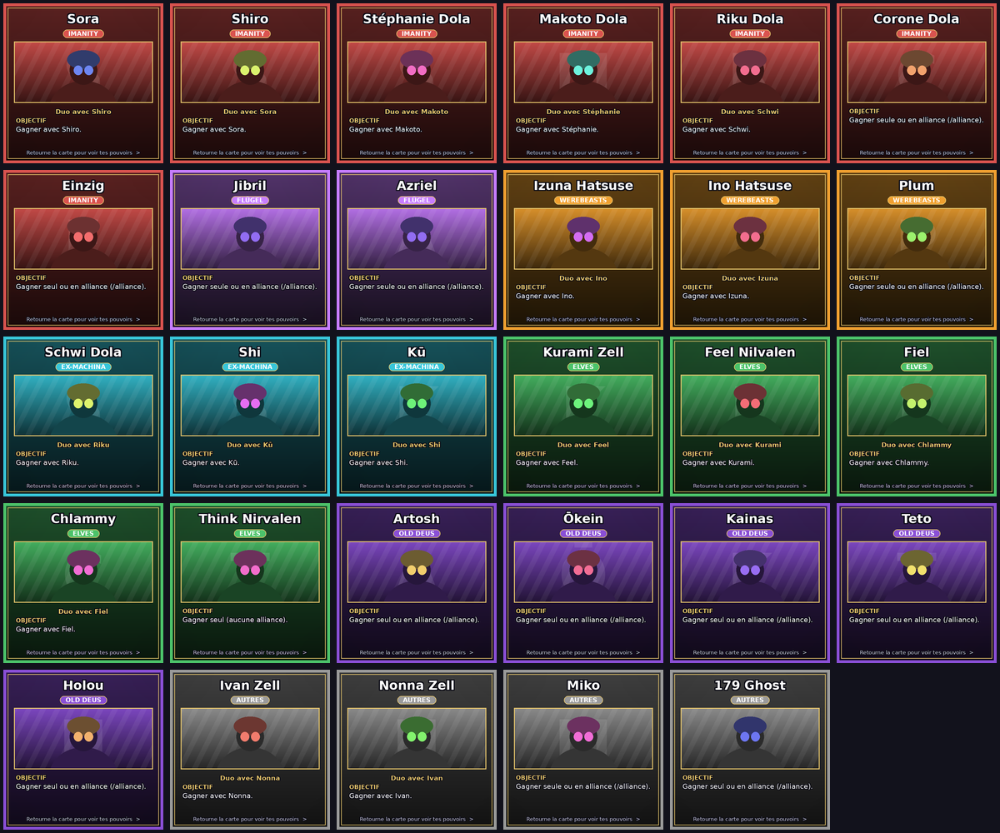
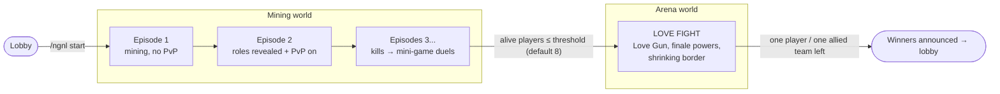
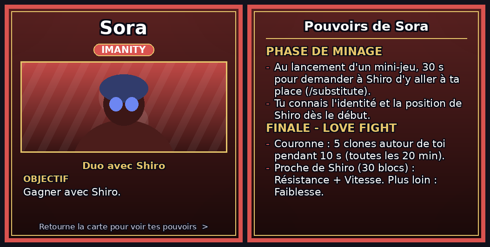
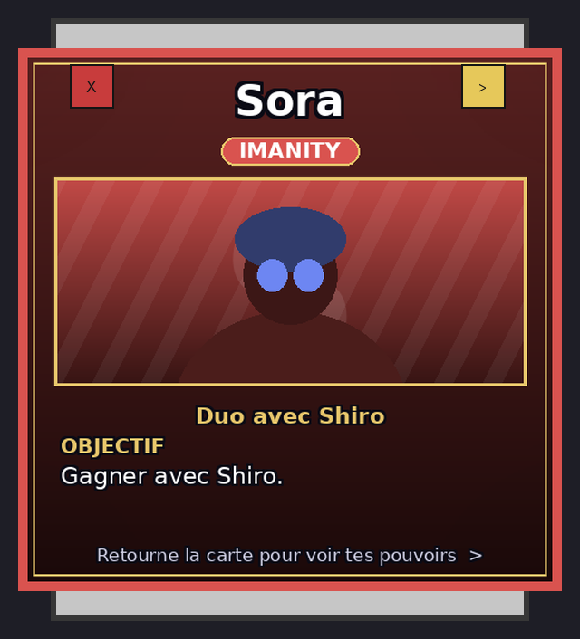

<div align="center">

# 🎲 No Game No Life UHC

**A Minecraft UHC where bloodshed is forbidden and everything is decided by games.**
29 roles · 14 mini-games · role cards with pictures · hidden items · a final *Love Fight* arena

   

[Design document (French)](https://docs.google.com/document/d/1blBPdmT5l3AH29eRe4WNXCGbC-yFB59FCwmSEmxozhI/edit?usp=sharing) ·
[Testing guide](docs/TESTING.md) · [Role reference](#-roles) · [Setup for a meetup](#-running-a-meetup--a-long-game)



</div>

---

## Table of contents
1. [Quick start](#-quick-start)
2. [How a game works](#-how-a-game-works)
3. [Role cards](#-role-cards--pictures)
4. [Running a meetup / a long game](#-running-a-meetup--a-long-game)
5. [Commands](#-commands)
6. [Roles](#-roles)
7. [Mini-games](#-mini-games)
8. [Worlds](#-worlds)
9. [Special items](#-special-items)
10. [Configuration](#-configuration)
11. [Customising the cards](#-customising-the-cards)
12. [Building](#-building)

---

## 🚀 Quick start

1. Build the jar (`./gradlew build`) or take it from the releases, and drop it in `plugins/` of a **Purpur / Paper 1.21.4** server (Java 21). No other plugin is required.
2. Start the server once: the lobby, the mini-game world and the arena world are created automatically (the arena generates a small tower city if you do not provide a map — see [Worlds](#-worlds)).
3. Decide how players get the **role card resource pack** (section [Role cards](#-role-cards--pictures)). Without it the cards are shown as plain text.
4. Everybody joins, then as an operator: `/ngnl start`. That is all — the plugin handles the rest.

> Minimum number of players: `game.minimum_players` (default 4). For a solo test see [docs/TESTING.md](docs/TESTING.md).

---

## 🧭 How a game works



| Step | What happens |
| --- | --- |
| **Lobby** | Quartz platform. PvP and damage are off. |
| **Episode 1** (20 min) | Everybody is scattered in a fresh mining world. Mine, craft, hunt for the hidden items. |
| **Episode 2** | Roles and factions are given: a **card pops up** for each player. PvP is enabled. |
| **Kills = mini-games** | A lethal hit never kills. The two players are pulled into a **mini-game duel**. If the PvP winner loses the game he loses **3 max hearts**, if the PvP loser loses he loses **5**. At 0 hearts: eliminated (only the dead player's **role** is announced, never his name). Falls, lava and mobs can't kill you either — you stay at 1 heart. |
| **50–80 min** | The approximate position of **Nina Clive**, guardian of the *Aka Si Anse*, is announced. |
| **Arena** | When few enough players remain (`arena_player_threshold`, default 8) everybody is teleported to the arena. Traditional weapons are disabled, everyone gets the **Love Gun**, every role unlocks its **finale powers** and the border shrinks. |
| **End** | The last player — or the last allied team (duo / `/alliance`) — wins. Everybody returns to the lobby, the mining world is regenerated. |

---

## 🃏 Role cards & pictures

When roles are revealed, every player sees a **popup card** with a picture and the explanation of his role. It has two pages (front: portrait + objective, back: mining and finale powers), can be closed with `ESC` and reopened any time with **`/role`**.



<details>
<summary><b>How it is displayed (and what it looks like in game)</b></summary>



*Mock-up: the real popup is a 6-row chest window; the `X` (close) and `>` (flip the card) buttons are the two items in the top corners.*

* The card is cut in **2×2 tiles of 256 px** (a 512 px card). The plugin opens an inventory whose **title** is made of custom font characters; the resource pack tells Minecraft that each character is one tile. No mod and no shader is needed.
* If you prefer sharper cards: `python3 tools/generate_resourcepack.py --size 1024` (tiles of 512 px) or `--grid 4` (16 tiles).
* Players who did not load the pack get a **text card** instead (name, faction, objective, powers).
</details>

### Getting the pack to your players — choose one

| Option | How |
| --- | --- |
| **A. Built-in host** (easiest) | `resourcepack.self-host.enabled: true`, `public-host: your.ip.or.domain`, open TCP port `8123` (or change it). The plugin serves the pack bundled in the jar. |
| **B. Your own URL** | Upload `NGNL-ResourcePack.zip` (also at `src/main/resources/resourcepack/`) anywhere with a direct link (GitHub release, your web server…) and set `resourcepack.url` (+ `resourcepack.sha1`). |
| **C. `server.properties`** | You can also use the vanilla `resource-pack=` / `resource-pack-sha1=` fields. |

The pack is sent on join (`send-on-join`) so it is loaded before the roles appear. Set `required: true` to kick players who refuse it.

---

## 🎪 Running a meetup / a long game

### Before the day
- [ ] **Hardware**: 4 GB RAM minimum, 6–8 GB for 15+ players; `view-distance=8`, `simulation-distance=6` in `server.properties`.
- [ ] **Voice**: the game is designed to be played on **Mumble** (no text chat talk). Prepare a channel and, if you want, a muted lobby. Only some duos may message each other (`/duo message`, once per episode).
- [ ] **Pack hosting** tested from a player machine (option A needs the port reachable from outside).
- [ ] **Whitelist** (`whitelist on`) and op only the organisers.
- [ ] **Pre-generate the mining world** to avoid lag while everybody mines: the world is recreated right after each game (`destroy_worlds_after_game: true`), so as soon as a game ends (or at server start) run [Chunky](https://modrinth.com/plugin/chunky) on `ngnl_mining` with radius = `mining_world_border_size`. Use `world.generation.mining_seed` if you want the same map for several sessions.
- [ ] Do a **dry run** with 2–3 friends using the [testing guide](docs/TESTING.md).

### Recommended settings

| | Quick demo (4–6 players, ~30 min) | **Meetup (10–16 players, 2–3 h)** | Long game (20+ players, 4 h+) |
| --- | --- | --- | --- |
| `game.episode_length` | 5 | **20** | 20–25 |
| `game.arena_player_threshold` | 3 | **8** | 8–10 |
| `game.minimum_players` | 4 | 8 | 12 |
| `world.mining_world_border_size` (radius) | 300 | **1000** | 1500 |
| `game.aka_si_anse_appear_time` | 15 (announced 5–35 min) | **60** (50–80 min) | 70 |
| `arena.initial-border-size` / `final-border-size` | 150 / 40 | **300 / 50** | 400 / 50 |
| `arena.border-shrink-interval` (s) | 60 | **120** | 120 |

Change a value with `/ngnladmin config <name> <value>`, in `config.yml`, or with the GUI `/ngnlconfig` (only while no game is running; `/ngnl reload` re-reads the file).

### Timeline of a typical 16-player meetup
| Time | Event |
| --- | --- |
| 0:00 | `/ngnl start`, scatter, episode 1 (no PvP) |
| 0:20 | Episode 2: **roles revealed**, PvP on |
| 0:40 – 1:00 | First duels / mini-games, shop purchases (`/shop` for Imanity) |
| 0:50 – 1:20 | **Nina Clive** position announced (Aka Si Anse) |
| 1:30 – 2:00 | ≤ 8 players → **arena**, finale powers |
| ~2:15 | Winners announced |

### During the game — organiser cheat-sheet
| I want to… | Do |
| --- | --- |
| Follow the state | `/ngnl info`, the scoreboard |
| Skip to the arena | `/ngnl forcearena` (during the mining phase) |
| Stop a game | `/ngnl stop` or `/ngnladmin end` |
| Give a specific role (testing) | `/ngnl setrole <player> <ROLE>` |
| Hurt a player for a test | `/forcekill <player> [hearts]` |
| Rules reminder to players | `/role`, `/minigame help` |

### Good to know (avoids surprises)
- Only the **role** of a dead player is announced. **Holou** may hide even that from everybody but himself.
- A player who disconnects stays alive (and keeps his role and hearts); he can rejoin, but he is exposed while offline, so ask players not to leave.
- Deleting the mining world on game end is automatic: never put builds in `ngnl_mining`.
- Want your own Love Fight map? Put it in `ngnl_arena_city/` (world folder) before the first start.

---

## ⌨️ Commands

| Command | Who | Description |
| --- | --- | --- |
| `/ngnl start` · `stop` · `info` · `roles` · `forcearena` · `setrole <player> <role>` · `reload` · `settings …` | OP | Game administration |
| `/ngnladmin` (`/ngadmin`) `start\|end\|startarena\|config …` | OP | Alternative admin command |
| `/ngnlconfig` | OP | Configuration GUI |
| `/role` (`/r`) | all | Reopen your **role card** |
| `/alliance <player>` · `/alliance accept <player>` · `/alliance break` | solo roles | Form an alliance (not Think Nirvalen) |
| `/challenge <player> <wager>` · `/rps` | all | Rock-paper-scissors challenge (diamonds, XP, info or hearts) |
| `/pledge <player> <terms>` | all | Binding agreement during the mining phase |
| `/duo message <text>` | duos | One private message per episode |
| `/shop` | Imanity | Buy special items |
| Role commands | role | `/substitute` `/acceptsub` `/bonus` (Sora/Shiro), `/duo cancel` (Makoto), `/duo choosegame` (Stéphanie), `/duo together` (Kurami/Feel), `/duo joincorone` `/duo joinriku` (Nonna), `/duo joinmiko` (Izuna), `/heal` (Riku), `/forest` (Kainas), `/teleport <p1> <p2>` (Holou), `/rite <1\|2>` (Think) |

---

## 🎭 Roles

29 roles in 7 factions — 8 duos and 13 solos. Solos may team up with `/alliance`. The text below is exactly what is written on the cards (French).

<details>
<summary><b>🔴 Imanity</b> — 7 rôles · avantage : `/shop` : objets spéciaux contre émeraudes / or</summary>

#### Sora (duo avec **Shiro**)
*Gagner avec Shiro.*

**Minage**
- Au lancement d'un mini-jeu, 30 s pour demander à Shiro d'y aller à ta place (/substitute).
- Tu connais l'identité et la position de Shiro dès le début.

**Finale**
- Couronne : 5 clones autour de toi pendant 10 s (toutes les 20 min).
- Proche de Shiro (30 blocs) : Résistance + Vitesse. Plus loin : Faiblesse.

#### Shiro (duo avec **Sora**)
*Gagner avec Sora.*

**Minage**
- Au lancement d'un mini-jeu, tu peux donner un bonus à Sora (2 fois par partie, /bonus).
- Tu connais l'identité et la position de Sora dès le début.

**Finale**
- Couronne : 5 clones autour de toi pendant 10 s (toutes les 20 min).
- Proche de Sora (30 blocs) : Résistance + Vitesse. Plus loin : Faiblesse.

#### Stéphanie Dola (duo avec **Makoto**)
*Gagner avec Makoto.*

**Minage**
- Une fois par partie, tu choisis le mini-jeu (si tu as gagné le PvP).
- Vitesse I pendant Parkour et The Floor Is Lava.

**Finale**
- Love Gun : touche un joueur pour le mettre à 6 cœurs pendant 30 s (toutes les 10 min).

#### Makoto Dola (duo avec **Stéphanie**)
*Gagner avec Stéphanie.*

**Minage**
- Une fois par partie, tu peux annuler une défaite de mini-jeu (/duo cancel).
- Aucun effet pendant les mini-jeux.

**Finale**
- Si Stéphanie meurt, tu t'allies automatiquement avec le joueur qui a gagné le plus de mini-jeux.

#### Riku Dola (duo avec **Schwi**)
*Gagner avec Schwi.*

**Minage**
- Chaque mini-jeu gagné te donne 1 cœur en plus.
- Si tu survis 5 min après la mort de Schwi, elle revient à tes côtés (vous perdez 3 cœurs chacun).

**Finale**
- Si Schwi est sous 3 cœurs : Force II pendant 30 s.
- /heal : donne 2 PV à Schwi (illimité).

#### Corone Dola (solo)
*Gagner seule ou en alliance (/alliance).*

**Minage**
- Tu connais l'identité de Riku.
- Régénération automatique.

**Finale**
- Tu vois 179 Ghost même invisible.
- Si Ivan meurt, Nonna peut te rejoindre : Vitesse I pour vous deux.

#### Einzig (solo)
*Gagner seul ou en alliance (/alliance).*

**Minage**
- Tu connais l'identité de Sora.

**Finale**
- Deux vies : d'abord un homme faible (Faiblesse II, 10 cœurs),
- puis Force et 8 cœurs après ta première mort.
- Si tu tues Riku, tu rejoins le camp de Sora.

</details>

<details>
<summary><b>🟣 Flügel</b> — 2 rôles · avantage : Bibliothèque cachée (table d'enchantement) utilisable 1 fois par partie</summary>

#### Jibril (solo)
*Gagner seule ou en alliance (/alliance).*

**Minage**
- Aucun avantage en mini-jeu.
- Régénération automatique.

**Finale**
- Livre des 18 ailes : une catastrophe aléatoire (nucléaire, lave, cratère, zone radioactive).
- Tu ne subis aucun dégât de tes catastrophes (toutes les 20 min).

#### Azriel (solo)
*Gagner seule ou en alliance (/alliance).*

**Minage**
- Tu détectes les mouvements des Flügel dans un rayon de 50 blocs.
- Une fois par épisode, tu copies temporairement le pouvoir d'un Flügel proche.

**Finale**
- Zone anti-vol : le vol est désactivé 30 s autour de toi (toutes les 20 min).

</details>

<details>
<summary><b>🟠 Werebeasts</b> — 3 rôles · avantage : Flèche de détection anonyme (40 blocs)</summary>

#### Izuna Hatsuse (duo avec **Ino**)
*Gagner avec Ino.*

**Minage**
- Tu aveugles ton adversaire pendant le Bloc Party.

**Finale**
- Vitesse II et une flèche qui te guide vers Ino.
- Si Ino meurt : couronne de 5 clones (10 s, toutes les 20 min)
- et tu peux rejoindre Miko (Faiblesse II pendant 5 min).

#### Ino Hatsuse (duo avec **Izuna**)
*Gagner avec Izuna.*

**Minage**
- Tu ralentis ton adversaire pendant TNT Run et Splegg.

**Finale**
- Bouclier Hatsuse : Izuna est invincible, invisible et ne peut pas frapper pendant 30 s (toutes les 20 min).
- Si Izuna meurt : Force II 10 s pour tuer son meurtrier, sinon tu meurs avec elle.

#### Plum (solo)
*Gagner seule ou en alliance (/alliance).*

**Minage**
- Tu vois les contours des joueurs dans le noir.
- 3 dispositifs d'écoute qui enregistrent les conversations (20 % de risque d'être repérés à 5 blocs).

**Finale**
- Sort de cécité : aveugle les ennemis proches (toutes les 15 min).

</details>

<details>
<summary><b>🔵 Ex-Machina</b> — 3 rôles · avantage : +1 drop sur les minerais</summary>

#### Schwi Dola (duo avec **Riku**)
*Gagner avec Riku.*

**Minage**
- Vitesse et Saut amélioré dans TOUS les mini-jeux.
- Si Riku meurt, tu meurs de tristesse.

**Finale**
- Force (réduite) et une Alliance : les ennemis à moins de 30 blocs brillent (toutes les 10 min).

#### Shi (duo avec **Kū**)
*Gagner avec Kū.*

**Minage**
- Ta santé est partagée avec Kū : il faut vous éliminer tous les deux.
- Tu analyses les mini-jeux passés de ton adversaire.

**Finale**
- Noyau de sécurité : zone où aucun dégât ne peut être infligé (toutes les 20 min).

#### Kū (duo avec **Shi**)
*Gagner avec Shi.*

**Minage**
- Ta santé est partagée avec Shi.
- Ton scanner détecte les porteurs d'objets spéciaux à 30 blocs.

**Finale**
- Impulsion de réparation : répare tout l'équipement de Shi (toutes les 20 min).

</details>

<details>
<summary><b>🟢 Elves</b> — 5 rôles · avantage : +1 niveau sur les enchantements</summary>

#### Kurami Zell (duo avec **Feel**)
*Gagner avec Feel.*

**Minage**
- Une fois par partie, lie un mini-jeu à Feel : en cas de défaite, vous tombez tous deux à 5 cœurs.
- Deux vies au Dés à coudre et au Bloc Party.

**Finale**
- Oracle Card : échange la place de 2 joueurs hors combat (toutes les 20 min).
- 20 % de risque d'être téléportée à la place de l'un d'eux.

#### Feel Nilvalen (duo avec **Kurami**)
*Gagner avec Kurami.*

**Minage**
- Une fois par partie, lie un mini-jeu à Kurami : en cas de défaite, vous tombez tous deux à 5 cœurs.
- Deux vies à Anvil Rain et The Floor Is Lava.

**Finale**
- Oracle Card : téléporte-toi auprès de Kurami, invisible 30 s (toutes les 20 min).

#### Fiel (duo avec **Chlammy**)
*Gagner avec Chlammy.*

**Minage**
- Une fois par épisode, crée une illusion de toi et échange ta place avec elle (1 fois par partie).
- Tu connais l'identité et la position de Chlammy.

**Finale**
- Masque d'illusion : prends l'apparence d'un autre joueur pendant 30 s (toutes les 15 min).

#### Chlammy (duo avec **Fiel**)
*Gagner avec Fiel.*

**Minage**
- Une fois par épisode, lis l'esprit d'un joueur pour connaître son inventaire.
- Tu connais l'identité et la position de Fiel.

**Finale**
- Orbe de prédiction : ralentit un adversaire proche pendant 20 s (toutes les 15 min).

#### Think Nirvalen (solo)
*Gagner seul (aucune alliance).*

**Minage**
- Tu connais la position de l'Aka Si Anse.
- Chaque kill te rapporte 1 cœur supplémentaire.

**Finale**
- /rite 1 : invisible et vol pendant 2 min (prend fin au premier dégât).
- /rite 2 : Lévitation sur un joueur pendant 5 s.
- Une seule utilisation par rite.

</details>

<details>
<summary><b>🟤 Old Deus</b> — 5 rôles · avantage : −30 % de dégâts PvE / environnement</summary>

#### Artosh (solo)
*Gagner seul ou en alliance (/alliance).*

**Minage**
- Tu apprends qui est Schwi (40 % de chance d'info fausse).
- Force pendant 5 min après chaque kill.

**Finale**
- 18 Ailes (élytres) pour planer entre les bâtiments.
- Lame de l'Infini : tue les ennemis à moins de 2 cœurs dans 5 blocs (+1 cœur par kill).
- Les dégâts de Jibril sur toi sont doublés.

#### Ōkein (solo)
*Gagner seul ou en alliance (/alliance).*

**Minage**
- Tu connais le rôle du premier joueur blessé.
- Enclume, 200 niveaux, Résistance au feu, livre Flame : seul à pouvoir utiliser le feu.
- L'eau te brûle (1 cœur/s).

**Finale**
- Marteau de destruction : pluie d'enclumes 5x5, 4 cœurs chacune (toutes les 15 min, 5 si kill).

#### Kainas (solo)
*Gagner seul ou en alliance (/alliance).*

**Minage**
- Tu connais le rôle du premier joueur à obtenir la régénération.
- /forest : tout le végétal à l'infini.
- Le feu te fait des dégâts doublés.

**Finale**
- Cage végétale 5x5 pendant 1 min : régénération + vitesse pour toi, Lenteur II pour les autres (15 min, 10 si kill).

#### Teto (solo)
*Gagner seul ou en alliance (/alliance).*

**Minage**
- Tu connais le rôle d'un joueur de ton choix.
- Tu choisis toujours le mini-jeu, même sans gagner le PvP.

**Finale**
- Roi d'échec : invincible 10 s, ta position est révélée, −2 cœurs (toutes les 10 min).
- Rappel royal : ressuscite le joueur de ton choix, il devient ton allié.

#### Holou (solo)
*Gagner seul ou en alliance (/alliance).*

**Minage**
- Au début, cache les pseudos et rôles des morts contre 2 cœurs (toi seul les vois).
- /teleport <joueur> <joueur> : échange la place de 2 joueurs (1 fois), ils reçoivent un livre aléatoire.

**Finale**
- Bâton de téléportation : à 30 blocs du joueur de ton choix, aveugle 5 s (toutes les 10 min).
- Aucun dégât des catastrophes de Jibril.

</details>

<details>
<summary><b>⚪ Autres</b> — 4 rôles · avantage : Défini par le rôle</summary>

#### Ivan Zell (duo avec **Nonna**)
*Gagner avec Nonna.*

**Minage**
- Bâton de recul au Sumo (1 utilisation par manche).
- Tu connais Riku et Nonna sans savoir qui est qui (10 % d'info fausse).

**Finale**
- ID Helmet (fer, Protection I) : révèle les traces de pas des joueurs pendant 10 s.

#### Nonna Zell (duo avec **Ivan**)
*Gagner avec Ivan.*

**Minage**
- Bâton de recul au Sumo (1 utilisation par manche).

**Finale**
- Oracle Card : téléporte un joueur au hasard sur la carte (20 % de risque que ce soit toi).
- Si Ivan meurt : rejoins Corone (Vitesse I) ou Riku et Schwi (Faiblesse à moins de 10 blocs de Riku).

#### Miko (solo)
*Gagner seule ou en alliance (/alliance).*

**Minage**
- Tu connais l'identité de Riku.
- 12 cœurs pendant toute la partie.

**Finale**
- Œil mécanique : fait revenir les joueurs proches 10 s en arrière (toutes les 20 min).
- Si Ino meurt, Izuna peut te rejoindre : Hâte II pour vous deux.

#### 179 Ghost (solo)
*Gagner seul ou en alliance (/alliance).*

**Minage**
- Tu reçois les identités de Riku, Corone, Lily et Schwi (sans savoir qui est qui).

**Finale**
- Invisible, Vitesse II, pas de dégâts de chute, mais tu ne peux pas attaquer.
- Objet Fantôme : redeviens visible (5 min avant de pouvoir disparaître).
- Si tu tues Corone, elle rejoint ton équipe.

</details>

---

## 🎮 Mini-games

Spleef · Splegg · TNT Run · Parkour · Bloc Party · Sumo · The Floor Is Lava · Dés à coudre · Anvil Rain · Word Chain Battle · Logical Deduction · Mental Chess · Memory Game · Materialization Shiritori · Oracle Card.
The game to play is drawn by a roulette; the PvP winner can re-roll it once, **Stéphanie** and **Teto** can pick it. The winner receives a random enchanted book. Roles change the rules (Schwi is faster, Izuna blinds in Bloc Party, Ino slows in TNT Run/Splegg, Kurami/Feel get two lives in some games…).

---

## 🌍 Worlds

| World | Purpose |
| --- | --- |
| `ngnl_waiting` | Lobby — a quartz platform is generated |
| `ngnl_mining` | Qualification world, deleted and regenerated after each game (`destroy_worlds_after_game`), optional fixed seed |
| `ngnl_minigame` | Void world hosting the mini-game rooms (mobs cleared at each start) |
| `ngnl_arena_city` | Final arena. **Put your own map in this folder**, otherwise a city of towers is generated on the first start |

---

## 🧿 Special items

| Item | Where | Effect |
| --- | --- | --- |
| **Aka Si Anse** | Dungeon guarded by **Nina Clive** (fragile, powerful; she can't kill — a lethal hit teleports you away with 5 hearts). Position announced 50–80 min in; Think knows it from the start | Pick a player: he falls to 2 hearts, players within 30 blocks are hurt. One use |
| **Suniaster** | On a cloud near the spawn; Old Deus know the coordinates | First Old Deus to take it gets 15 hearts. Others should burn it |
| **Blood Destruction Bomb** | `/shop` | Hurts everybody within 20 blocks, the user takes half. One use |
| **Elf Runes** | `/shop` | Reveals the movements of everyone inside for 3 min, visible to all |
| **Imanity Crown** | `/shop` | Resistance for 45 s but you glow (position visible). 5 min cooldown |
| **Ex-Machina Core** | `/shop` | Records an ability used against you, replay it once |
| **Old Deus Fragment** | `/shop` | Cancels a recent mini-game defeat for 3 hearts |

Faction perks: Imanity shop · Flügel library (enchanting table, once per game) · Werebeasts' detection arrow · Ex-Machina +1 ore drop · Elves +1 enchant level · Old Deus −30 % PvE damage. Two members of a faction within 15 blocks get a small buff; killing a member of your own faction before the arena makes you **glow** in the finale (traitor).

---

## ⚙️ Configuration

Main file: `plugins/NoGameNoLifeUHC/config.yml` (see the comments inside).

| Key | Default | Meaning |
| --- | --- | --- |
| `game.episode_length` | 20 | Minutes per episode |
| `game.arena_player_threshold` | 8 | Alive players that trigger the arena |
| `game.minimum_players` | 4 | Needed to start |
| `game.pvp_enable_episode` | 2 | Episode where PvP starts (roles are always revealed at episode 2) |
| `game.allow_solo_alliances` | true | `/alliance` enabled |
| `game.aka_si_anse_appear_time` | 60 | Announcement between (value−10) and (value+20) min |
| `world.mining_world_border_size` | 1000 | Radius of the mining world |
| `world.destroy_worlds_after_game` | true | Fresh mining world every game |
| `world.generation.mining_seed` | empty | Fixed seed (random if empty) |
| `arena.*` | see file | Arena border, shrink speed, Love Gun damage/cooldown |
| `resourcepack.*` | see file | How the card pack is delivered |
| `roles.enabled.<role>` | true | Disable a role (GUI: `/ngnlconfig`) |
| `factions.*` | true | Faction bonuses, proximity buffs, betrayal penalty |

---

## 🖼️ Customising the cards

```bash
pip install pillow
python3 tools/generate_resourcepack.py          # rebuilds the pack, the tiles and cards glyph layout
python3 tools/make_readme_images.py             # refreshes the pictures of this README
```

* **Portraits**: put `tools/portraits/SORA.png`, `SHIRO.png`, `JIBRIL.png`… (role names in capitals, any size, they are cropped to fit). Without a file a placeholder is drawn.
* **Texts**: edit `tools/cards_data.py` (French, one entry per role).
* Rebuild the jar afterwards: the pack is bundled in it.

---

## 🔨 Building

`./gradlew build` — produces the jar and copies it to `server/plugins`. Targets Purpur/Paper 1.21.4, Java 21, no dependency plugin.

License: see [LICENSE](LICENSE).
